# Introduction
This is a crackme challenge made my “crackinglessons.com”. A simple GUI-based crackme which is intended for beginner reverse engineers.
The challenge:
1. Find the serial key and enter it in the textbox.
2. Patch the file to always show the congrats message when you click the Check button.

In this writeup, I created three sections for analysis. First one is for static analysis, second section is for dynamic analysis, and the last one is for disassembling and debugging. The static analysis will be the part where i will find the characteristics and any interesting attribute of the software. 
The dynamic analysis will be the part where i run the program, find out its behaviors, what it looks like and what it will do.
And the last part is disassembling and debugging where i analyze the low level code of the program.

# Static Analysis
The first thing i did is to find out what are the attributes of the program and i used pestudio to determine the attributes. As per the software author, the compiler that they used is Visual studio C++ 2017. The software is GUI and it runs on a 32bit machine.

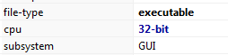

Next is finding useful strings in the program. I found a string “cr4ckingL3ssons” as a likely serial key to be used in the program and next to it are words like “Congrats” and “Well done!”.

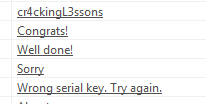

# Dynamic Analysis
I run the program so i could find out what it looks like and it’s behavior. The program itself have a very simple design, a window will be shown with a text box to enter the password and two buttons below.

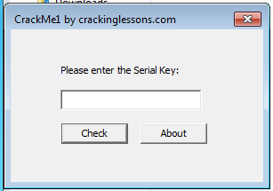

I randomly put different things to find out the behavior of the software. First, i clicked the “check” button to see what will happen.

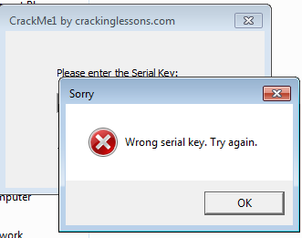

The program produced another window that says “Wrong serial key. Try again”. I tried putting a series of strings. First, i put a series of numeric number.

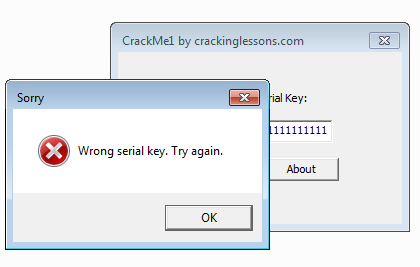

I tried putting strings and alphanumeric but it also produces similar results. Next i used, the string “cr4ckingL3ssons” that i found earlier to test whether it will work.

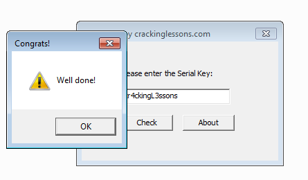

The program produced a different windows. I can conclude the first challenge, in which i found the serial key. Next is to disassemble the program and find where the main code and logic of the program is.

# Disassembling and Debugging
First, i need to find the main code. I opened up the program using IDA free to disassemble it. As the author mentioned that the program was compiled using Microsoft Visual Studio C++ 2017, i need to find a certain pattern. At relative address, #1333, i found the pattern of likely the main code. The pattern is composed of 3 “push” commands followed by a call to the main code address.

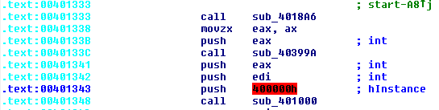

Once i found the main code. The first thing i noticed was the API for creating a dialog box.

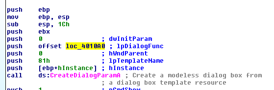

In the API there is a location for a Dialog Function. Located in the address dialog function are the message boxes that will pop up if the serial key is correct or not, the assembly code for the serial key and the code to check whether you click the “check” button or the “about” button. 

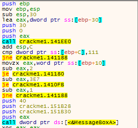

The jump comparison to the relative address 000010FB is of interest as it lead directly to the assembly code where the serial key will be compared to the text entered by the user. Below is the screenshot of that address.

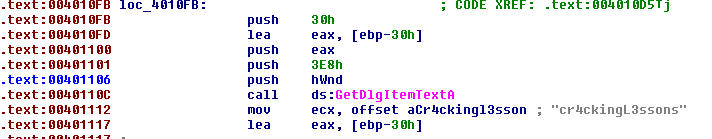

The call to “GetDlgItemTextA” will retrieve the text that was entered in the serial text box. Below the call function is a “mov” command that will retrieve the address of the serial key and put to ecx. Ass you can see, the string “cr4ckingL3ssons” was automatically commented by IDA pro at the right side.
After getting the user text, it will be compared to the serial key two characters at a time. Each character will be checked to see if it matched then move to the next character until the end of string. Below is the screenshot of the comparison. Highlighted is the code to compare two characters at a time.

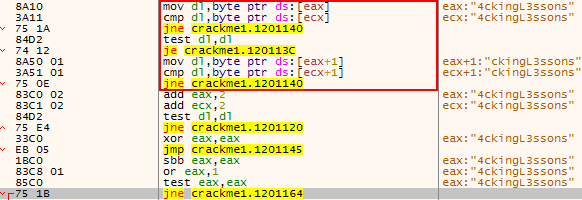

All assembly code “jne” included the one just below the highlight determines whether it will show a congratulatory message or the wrong serial message, similar to If/Else command. That means to prevent the program from showing the wrong serial key message box, we need to either modify the “jne” so that it could always jump to the congratulatory message box or we could modify it to “nop” command.

# Patching the Program
To patch the program, we need to open it using a hex editor, i used the program “010 Editor” and find all the hex code for the 3 “jne”. The hex code can be found at relative address 0000113Ah, 00001130h, and 00001124h in memory which will be equal to the address 053Ah, 0530h, and 0524h, respectively, in disk. Below is the screenshot hex equivalent of the codes.

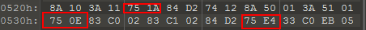

I’ll modify all the highlighted and change it to “90 90” which is the hex code for “NOP” command.

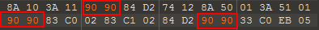

Now let’s save and run the program if the patch works.

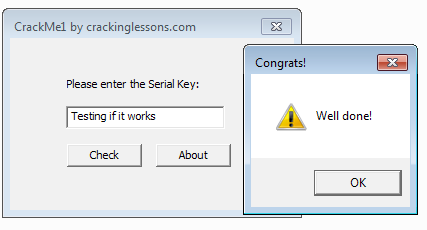

We successfully patched the program to always show the congratulatory message completing all the challenges.

# Conclusion

By far, one of the easiest and beginner friendly crackme. This challenge is good for beginners and students alike wanting to learn how to reverse engineer and teaching them the concepts and steps for proper procedure. 
